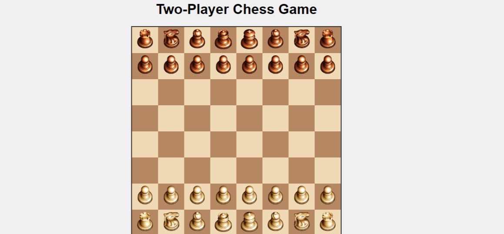

# Two-Player Chess Game

This is a simple two-player chess game implemented in HTML, CSS, and JavaScript. The game supports both touch/select and drag-and-drop functionalities for moving pieces and highlights possible moves when a piece is selected.

### Features

- **Chessboard**: Standard 8x8 chessboard layout.
- **Pieces**: Classic chess pieces with draggable functionality.
- **Turn-based Gameplay**: Alternates turns between white and black pieces.
- **Move Validation**: Validates legal moves according to standard chess rules.
- **Highlighting**: Highlights possible moves when a piece is selected.

### Technologies Used

- HTML
- CSS
- JavaScript

### Usage

To play the game, simply open `index.html` in a web browser that supports HTML5 and JavaScript.
OR
visit: (https://aashish-thapa.github.io/Chess/)

### Screenshots

### Contributing

Contributions are welcome! Please fork the repository and create a pull request with your proposed features.

### License

This project is licensed under the MIT License - see the [LICENSE](LICENSE) file for details.

### Acknowledgments

- Inspired by classic chess game mechanics.
- Thanks to [OpenAI](https://openai.com) for training ChatGPT, which assisted in developing this game.

---
